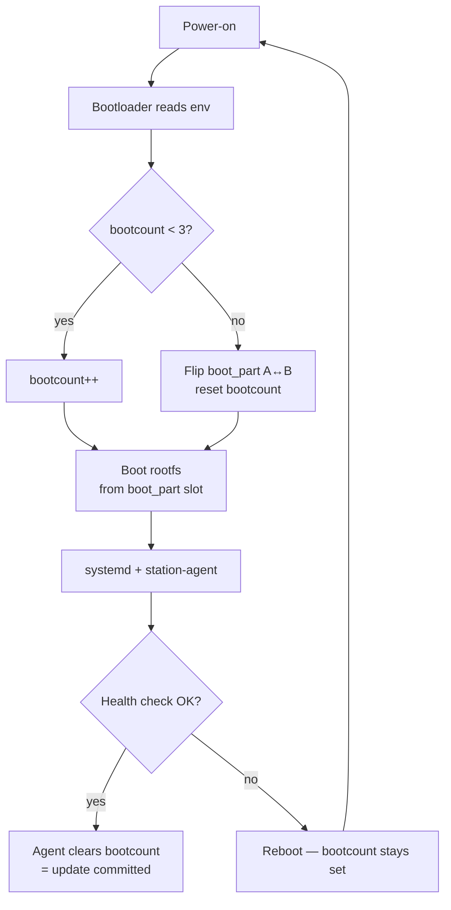
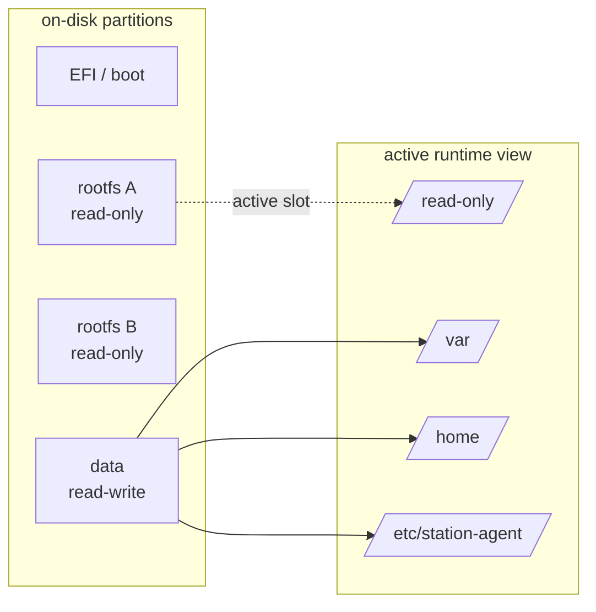

# OE5XRX Linux Image

[](https://github.com/OE5XRX/linux-image/actions/workflows/ci.yml)
[](LICENSE)
[](https://docs.yoctoproject.org/scarthgap/)

Yocto-based Linux image for the [OE5XRX Amateurfunkclub für Remote
Stationen](https://www.oe5xrx.at) (Austria) remote amateur radio station
fleet. Each station runs a Raspberry Pi Compute Module 4 connected to a
custom STM32 mainboard plus pluggable RF/audio modules.

The image is paired with the [station-manager][sm] server which handles
fleet management, OTA rollouts, live monitoring, and a browser-based
remote terminal.

[sm]: https://github.com/OE5XRX/station-manager

---

## Design highlights

- **A/B root filesystems** with bootcount + automatic rollback. A bad
  update reverts to the previous known-good slot after three failed boot
  attempts.
- **Read-only rootfs** with a dedicated persistent `data` partition.
  `/var`, `/home`, `/root` and `/etc/station-agent` are bind-mounted
  onto it so application state survives rootfs swaps.
- **Bootloader abstraction** — U-Boot on the Raspberry Pi target,
  GRUB-EFI on the x86-64 target. Both expose the same three env vars
  (`boot_part`, `bootcount`, `upgrade_available`) so the station agent
  doesn't care which board it's running on.
- **Station-agent integrated** as a Yocto recipe. Pulls directly from
  the `station-manager` repo's `station_agent/` subdir at build time.
- **On-demand CI builds** on Hetzner Cloud — a fresh CX43 server is
  spun up, builds the image into a persistent sstate-cache volume,
  uploads the artifact, and is deleted. About €0.02 per build after
  the cache is warm.

---

## Architecture

### A/B boot with automatic rollback

Both targets run the same logic — GRUB on x86-64, U-Boot on the Pi —
around three shared env variables: `boot_part`, `bootcount`,
`upgrade_available`.



After three bad boots of the new slot, the bootloader flips back to the
previous known-good slot on its own. No network, no server, no agent
required for rollback to work.

### Storage layout

Active slot is read-only; everything that changes lives on a dedicated
`data` partition, bind-mounted into the running rootfs.



### Release pipeline


Each `build.yml` invocation creates a fresh Hetzner CX43, attaches the
persistent sstate-cache volume, builds, uploads the artifact, and is
deleted. The two calls run serially because they share that cache
volume.

---

## Targets

| Machine | Config | Purpose |
|---------|--------|---------|
| `qemux86-64` | [`qemux86-64.yml`](qemux86-64.yml) | Development image, bootable in QEMU. GRUB-EFI + full A/B layout for offline testing. |
| `raspberrypi4-64` | [`raspberrypi4-64.yml`](raspberrypi4-64.yml) | Production image for Raspberry Pi Compute Module 4. U-Boot + A/B + read-only rootfs. |

Both targets share everything via `oe5xrx.yml`; only machine-specific
bits differ.

---

## Building locally

Prerequisites:

- [Kas](https://kas.readthedocs.io/) (`pip install kas`)
- Standard Yocto dependencies (see the [Yocto quick build
  guide](https://docs.yoctoproject.org/brief-yoctoprojectqs/))
- ~50 GB free disk for build + sstate-cache

```bash
# QEMU x86-64 (fast, useful for iterating)
kas build qemux86-64.yml

# Raspberry Pi CM4 (production)
kas build raspberrypi4-64.yml
```

Outputs land in `build/tmp/deploy/images/<machine>/`.

### Booting the qemux86-64 image in QEMU

A helper script is included: [`scripts/run-qemu.sh`](scripts/run-qemu.sh).

```bash
# Boot a local build, or whatever's already in the cache
./scripts/run-qemu.sh

# Pull the latest published release (verifies sha256 + decompresses)
./scripts/run-qemu.sh --release

# Pick a specific release tag
./scripts/run-qemu.sh --release v1-alpha

# Pull the latest CI artifact instead (unreleased, last 7 days)
./scripts/run-qemu.sh --fetch

# Or a specific GitHub Actions run
./scripts/run-qemu.sh --fetch 24543210987
```

The script handles OVMF UEFI firmware, KVM acceleration, user-mode
networking with SSH port-forward on `2222`, and A/B rootfs layout.

SSH in once booted:

```bash
ssh -p 2222 root@localhost
```

Test the A/B boot-switch / rollback from inside the guest:

```bash
grub-editenv /boot/EFI/BOOT/grubenv list
grub-editenv /boot/EFI/BOOT/grubenv set boot_part=b upgrade_available=1 bootcount=0
reboot
# After 3 failed boots of the (empty) slot B, GRUB rolls back to slot A
```

Prerequisites on the host: `qemu-system-x86`, `ovmf`, membership in
the `kvm` group. On Debian/Ubuntu: `sudo apt install qemu-system-x86
ovmf && sudo usermod -aG kvm "$USER"` (log out and back in).

Only the `qemux86-64` target is supported by the script. The
`raspberrypi4-64` image is designed to be flashed to real CM4
hardware — QEMU's `raspi4b` emulation lacks working Ethernet and
has no serial-getty path in our image, so it's not practical for
end-to-end testing.

---

## CI

Three workflows:

- **`ci.yml`** — every pull request and push to `main`. Parses all kas
  configs with `kas dump`, shellchecks the scripts, yamllints the YAML,
  sanity-checks the wks files. No Hetzner, no artifact.
- **`build.yml`** — reusable + manually dispatchable. Full Yocto build
  on an on-demand Hetzner CX43 for a single machine. Uploads the image
  artifact with 7-day retention. Used ad-hoc or called by `release.yml`.
- **`release.yml`** — triggered on a timestamped tag push
  (`YYYY.MM.DD-HH[a-z]`, see `scripts/release.sh`). Calls `build.yml`
  for **both** targets in parallel — each has its own cache volume —
  then signs each image with [cosign keyless][cosign] and publishes a
  GitHub Release with the images, SHA256 checksums, and `.bundle`
  signatures attached.

[cosign]: https://docs.sigstore.dev/cosign/signing/overview/

### Required GitHub Secrets

| Secret | Used by | Description |
|--------|---------|-------------|
| `HCLOUD_TOKEN` | `build.yml` | Hetzner Cloud API token |
| `HCLOUD_SSH_KEY_NAME` | `build.yml` | Name of an SSH key registered in Hetzner Cloud (for logging into the build server) |
| `HCLOUD_SSH_PRIVATE_KEY` | `build.yml` | Private half of the above key, used by GitHub's runner |
| `GH_PAT` | `build.yml` | Personal access token with `repo` scope — used to fetch a short-lived runner registration token |

The build server is disposable; only sstate-cache and download caches
are persisted via per-target named Hetzner volumes
(`oe5xrx-yocto-cache-qemux86-64`, `oe5xrx-yocto-cache-raspberrypi4-64`).
Each target has its own volume so both builds can run in parallel on a
release.

---

## Image contents

Each image ships with:

- [`station-agent`](https://github.com/OE5XRX/station-manager/tree/main/station_agent)
  — management agent (heartbeat, OTA, remote terminal). Authenticates
  via Ed25519 signatures.
- Python 3 + agent runtime dependencies
- OpenSSH, dfu-util (STM32 flashing), i2c-tools, htop
- systemd as init
- GRUB-EFI (x86) or U-Boot (RPi) with A/B boot logic

---

## Repository layout

```
.
├── oe5xrx.yml                           shared kas config
├── qemux86-64.yml                       x86-64 target
├── raspberrypi4-64.yml                  RPi CM4 target
├── include/raspberrypi.yml              meta-raspberrypi glue
├── meta-oe5xrx-remotestation/
│   ├── conf/layer.conf
│   ├── recipes-bsp/
│   │   ├── grub/                        grub-efi bbappend + embedded cfg
│   │   ├── grub-ab/                     seed grubenv with A/B defaults
│   │   └── u-boot-ab/                   U-Boot A/B boot.scr + fw_env.config
│   ├── recipes-core/
│   │   ├── ab-layout/                   systemd mount units + first-boot init
│   │   ├── base-files/                  fstab tweaks (RPi)
│   │   ├── images/                      production + development images
│   │   └── station-agent/               agent recipe
│   └── wic/                             partition layouts (x64 + RPi)
├── scripts/
│   └── run-qemu.sh                      local QEMU launcher for qemux86-64
└── .github/
    ├── workflows/
    │   ├── ci.yml                       fast PR / main checks
    │   ├── build.yml                    reusable Hetzner build (single target)
    │   └── release.yml                  tag-driven: build both + cosign + GH Release
    ├── ISSUE_TEMPLATE/bug.yml
    ├── PULL_REQUEST_TEMPLATE.md
    ├── CODEOWNERS
    └── dependabot.yml
```

---

## Contributing

1. Fork the repo
2. Create a feature branch (`git checkout -b fix/my-thing`)
3. Commit, push, open a PR
4. Wait for `ci.yml` to go green — it enforces recipe parsing, shellcheck, yamllint
5. A maintainer reviews + merges (squash or rebase; no merge commits)

The `main` branch is protected — direct pushes are blocked, every
change goes through PR review.

### Releases

Rolling releases are tagged as `YYYY.MM.DD-HH` in UTC (e.g.
`2026.04.19-14`). Use the helper:

```bash
./scripts/release.sh
```

It verifies the working tree is clean + in sync with `origin/main`,
generates the timestamp tag, shows the commits that will be included,
asks for confirmation, then tags and pushes. The push triggers
`release.yml`, which builds **both** machine images (qemux86-64 +
raspberrypi4-64), signs them with cosign keyless (Sigstore + GitHub
Actions OIDC), and publishes a GitHub Release with the images, SHA256
checksums, and signature bundles. See [SECURITY.md](SECURITY.md) for
how to verify a release before flashing it.

For a same-hour hotfix (rare), pass a lowercase suffix letter:

```bash
./scripts/release.sh --suffix a    # -> 2026.04.19-14a
./scripts/release.sh --suffix b    # -> 2026.04.19-14b if a is taken too
```

The helper only emits tags in the form `YYYY.MM.DD-HH` or
`YYYY.MM.DD-HH<suffix>` where `<suffix>` is a single lowercase letter
`a`–`z`; this is also the exact set the release workflow triggers on.
Legacy `v*` releases (`v1-alpha` … `v1-delta`) stay on GitHub as
historical artifacts — `scripts/run-qemu.sh --release v1-delta` can
still fetch them — but pushing a new `v*` tag no longer triggers a
build.

---

## License

[GPL-3.0-or-later](LICENSE). Same spirit as the Linux kernel + GNU
userland that the image is built from — improvements flow back to the
community.
